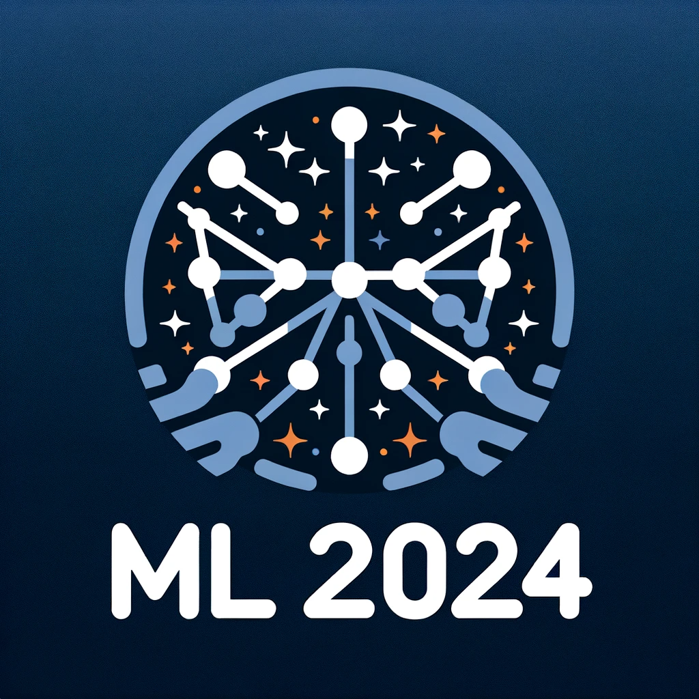

<h1 align="center">Machine Learning Study in 2024</h1>

   

## Weekly Presentation

| Week |    Date    |                      Lecturer                      |                       Contents                        |                                                                                                                                                                                               Refs & Materials                                                                                                                                                                                               |
|-----:|:----------:|:--------------------------------------------------:|:-----------------------------------------------------:|:------------------------------------------------------------------------------------------------------------------------------------------------------------------------------------------------------------------------------------------------------------------------------------------------------------------------------------------------------------------------------------------------------------:|
|    1 | 2023-11-12 | [Jinheung Kim](https://github.com/jinheungkim1216) |                   SYMBA, DL4SymMath                   |                                                                                                                [SYMBA (arXiv)](https://arxiv.org/abs/2206.08901) [DL4SymMath (arXiv)](https://arxiv.org/abs/1912.01412), [(code)](https://github.com/facebookresearch/SymbolicMathematics)                                                                                                                |
|    2 | 2023-12-02 |      [Yeji Park](https://github.com/hiilynn)       |              Parameter estimation, SGWB               |                                                                                                            [Notebook for MLP](./week02/parameter_estimation(MLP).ipynb) [Notebook for MPE](./week02/parameter_estimation(MPE).ipynb) [PBH & SGWB (arXiv)](https://arxiv.org/abs/2107.02181)                                                                                                            |
|    3 | 2023-12-10 |      [Soojin Lee](https://github.com/LSJ957)       |            Data analysis using ParticleNet            |                                                                       [Note (PDF)](https://www.dropbox.com/scl/fi/8j3lwe1lwmbp9zqs45c6q/week03_dataanalysisusingParticleNet.pdf?rlkey=p60wuayi4otj4o17cjmvs2xim&dl=0) [ParticleNet (arXiv)](https://arxiv.org/abs/1902.08570) [DGCNN (arXiv)](https://arxiv.org/abs/1801.07829)                                                                        |
|    4 | 2023-12-17 |      [Tae-Geun Kim](https://github.com/Axect)      | Transformer review & The principle of least action | [Slide for Transformer (PDF)](https://www.dropbox.com/scl/fi/nf1g4f3emxk2ujkhfo6ay/main.pdf?rlkey=c5op944bvdgvai5tank85f278&dl=0) [Slide for Least Action (PDF)](https://www.dropbox.com/scl/fi/1keofwp8gjoa9ckjl4p1u/main.pdf?rlkey=hkypjuoeuwidj2aqa51swgnwa&dl=0) [Least_Action (Github)](https://github.com/Axect/Least_Action) [RL for Least Action (arXiv)](https://arxiv.org/abs/2011.11891) |
|    5 | 2023-12-23 | [Donghun Yi](https://github.com/YiDonghun) [Tae-Geun Kim](https://github.com/Axect) | **The first offline meeting** D. Yi: Hyperspectral Imaging T.-G. Kim: AI News | [Weak-to-strong generalization](https://openai.com/research/weak-to-strong-generalization) [life2vec (Github)](https://github.com/SocialComplexityLab/life2vec) [Coscientist](https://www.cmu.edu/news/stories/archives/2023/december/cmu-designed-artificially-intelligent-coscientist-automates-scientific-discovery) [Forecasting of chaotic systems](https://journals.aps.org/prresearch/abstract/10.1103/PhysRevResearch.5.043252) [LLM inference in single gpu](https://ai.gopubby.com/unbelievable-run-70b-llm-inference-on-a-single-4gb-gpu-with-this-new-technique-93e2057c7eeb) [Midjourney v6](https://mid-journey.ai/midjourney-v6-release/)
